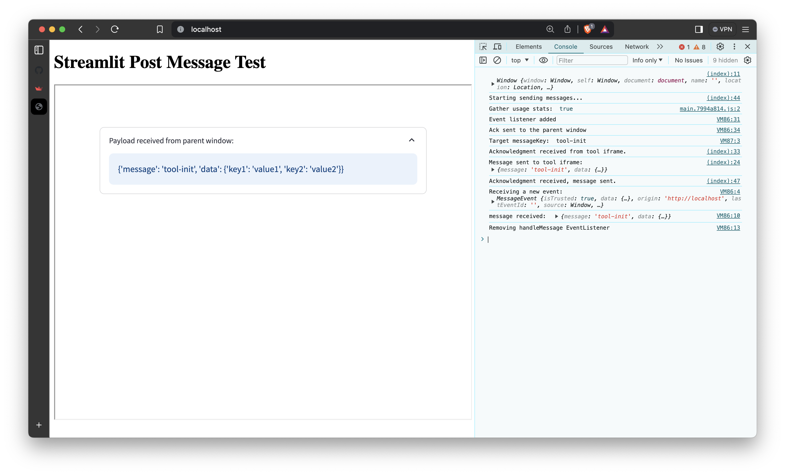

# 📊 Streamlit Post Message

Streamlit component for Streamlit applications embedded in an iFrame.

## 🚀 Background

This tool was developed to meet a basic need: to pass information between a Streamlit application, embedded in an **iFrame**, and a **JavaScript** based **WebApplication** (Vue, React...) via postMessage.

## 👨🏼‍💻 Implementation

The component uses [streamlit-javascript](https://github.com/thunderbug1/streamlit-javascript) to execute the javascript code.

*streamlit_post_message* is a "custom" Streamlit component that facilitates communication between a Streamlit application embedded in an iFrame and its parent window. The communication is handled using the postMessage API via an EventListener in JavaScript. Below is a detailed description of how the code works.

1. First, when the Streamlit application is loaded, a confirmation is sent to the parent window. This message tells to the parent window that the tool is listening for a postMessage, containing a generic Payload.

2. The tool is now listening for a postMessage from the parent window. The message must match the **message_key** in order to be accepted by the Streamlit component. **message_key** can be defined manually during the call to the def of the component.

3. The component will continue to be executed, with a specified delay between executions, until the payload is received from the parent window.

## ☢️ Running Locally / Development

### 🎁 Requirements

It's suggested to work with an anaconda virtual environment, with Python>=3.6. The code is actually developed and tested on Unix, with Python==3.10.12.

```shell
conda create -n spm python==3.10.12
conda activate spm
(spm) pip install -r requirements.txt
(spm) pip install -r requirements_dev.txt
```

### 🔎 Pre-commit

Using the pre-commit git hooks to ensure checks before committing.

```shell
(spm) pre-commit install
(spm) pre-commit autoupdate
```

## 🤖 Demo

This tool requires a specific structure to be followed by our JavaScript-based application Streamlit in an iFrame. For this reason, a very simple html/js-based demo is provided.

In two different terminals run:

```bash
(my_venv) python -m http.server 8000
```

```bash
(my_venv) streamlit run demo.py --server.port 8080
```

At `localhost:8000/index.html` you should see something like this:



For more details, please check [index.html](index.html) and [demo.py](demo.py).
